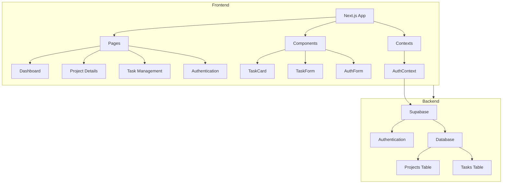

# Project Manager MVP

A modern project management application built with Next.js and Supabase.

## Architecture



### Architecture Components

#### Frontend
- **Next.js App**: The main application framework
  - **Pages**: 
    - Dashboard: Main project overview
    - Project Details: Individual project view with drag-and-drop task management
    - Task Management: Task creation and editing
    - Authentication: Login and signup
  - **Components**:
    - TaskCard: Display individual tasks with drag handle
    - TaskForm: Create and edit tasks
    - AuthForm: User authentication forms
  - **Contexts**:
    - AuthContext: Manages authentication state

#### Backend Services
- **Supabase**:
  - Authentication: User management and security
  - Database: 
    - Projects Table: Stores project information
    - Tasks Table: Stores task details and relationships

#### Data Flow
- Frontend components communicate with Supabase backend
- Authentication state is managed through AuthContext
- Real-time updates through Supabase subscriptions

## Features
- User authentication and authorization
- Project and task management
- Intuitive drag-and-drop task organization
- Real-time updates
- Task status tracking
- Due date management
- Responsive design

## Tech Stack
- **Frontend**: Next.js, React, TypeScript, Tailwind CSS
- **Backend**: Supabase (Auth + Database)
- **Styling**: Tailwind CSS
- **State Management**: React Context API
- **Drag and Drop**: DND Kit

## Getting Started
1. Clone the repository
2. Install dependencies: `npm install`
3. Set up environment variables:
   - Create `.env.local` file
   - Add your Supabase configuration
4. Run the development server: `npm run dev`

## Environment Variables
```env
NEXT_PUBLIC_SUPABASE_URL=your_supabase_url
NEXT_PUBLIC_SUPABASE_ANON_KEY=your_supabase_anon_key
```

## Database Schema
### Projects Table
- id: UUID (Primary Key)
- title: String
- description: Text
- created_at: Timestamp
- user_id: UUID (Foreign Key)

### Tasks Table
- id: UUID (Primary Key)
- title: String
- description: Text
- status: Enum ('todo', 'in_progress', 'done')
- due_date: Timestamp
- project_id: UUID (Foreign Key)
- order: Integer
